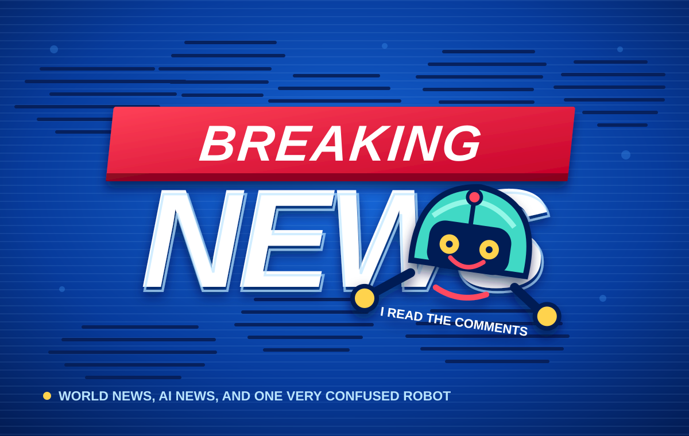
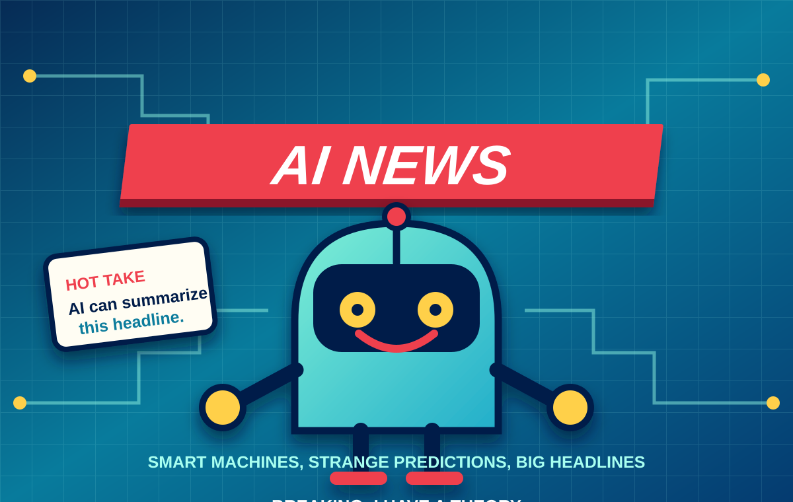
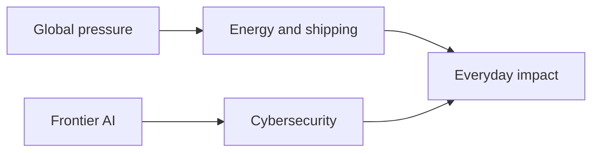

# CURRENT EVENTS

> **A visual briefing for a fast-moving world.**
>
> Two stories. Two systems under pressure. One place to understand what happens next.

**FIELD NOTES  /  ISSUE 01  /  UPDATED SEPTEMBER 14, 2026**

---

## The Latest Dispatches

### 01  |  GLOBAL

## [Oil Routes Under Pressure](global_events.md#oil-routes-under-pressure-hormuz-and-bab-el-mandeb)

The Strait of Hormuz and Bab el-Mandeb are more than lines on a map. They are pressure points for energy, shipping, insurance, and global prices.

**Read the global briefing -> [Open article](global_events.md)**

### 02  |  AI + CYBERSECURITY

## [Mythos and the New Cybersecurity Question](ai_events.md#mythos-and-cybersecurity-when-an-ai-model-becomes-part-of-the-threat-model)

Anthropic's Mythos model shows why frontier AI is both a defensive tool and a new part of the threat model.

**Read the AI briefing -> [Open article](ai_events.md)**

---

## The Visual Desk

The articles include diagrams designed to make complicated stories easier to scan:

| Explainer | What it shows |
| --- | --- |
| **Oil route map** | How Hormuz and Bab el-Mandeb connect producers, shipping lanes, and markets. |
| **AI threat model** | How model capabilities move from testing to defensive controls. |

## Editorial Note

This is a student current-events briefing focused on context, connections, and readable explanations. Each dispatch includes source links so readers can follow the reporting behind the summary.

---

**Browse:** [Global Events](global_events.md)  |  [AI Events](ai_events.md)
