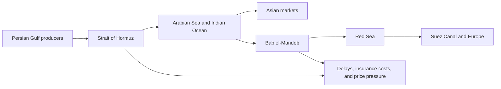

# Global Events

## Oil Routes Under Pressure: Hormuz and Bab el-Mandeb

**Published September 14, 2026**

Two maritime chokepoints are at the center of a new oil-supply shock. The Strait of Hormuz connects the Persian Gulf with the Gulf of Oman and the wider Indian Ocean. Bab el-Mandeb links the Red Sea with the Gulf of Aden. Together, they shape how quickly oil can move from Middle Eastern producers to markets in Asia and Europe.

Recent attacks and military pressure have made both routes less predictable. Reuters reported that attacks in and around Hormuz, along with strikes affecting Saudi energy infrastructure and ships in the region, pushed oil prices more than 2% higher. Another Reuters report said the Strait of Hormuz was largely shut by the conflict, with only about 4 million to 5 million barrels per day moving through it, roughly 4% to 5% of global oil supply.

The Bab el-Mandeb problem is different but connected. Reuters reported that Iran-aligned Houthis had reached strategic islands near the strait and that Saudi Arabia shut an oil pipeline as Red Sea shipping risks increased. The strait is also important for vessels carrying petroleum toward the Red Sea and Suez Canal. Reuters cited Kpler data estimating that petroleum volumes through Bab el-Mandeb represented about 7% of global oil output in June.

The result is not simply higher prices. Tankers may have to wait, reroute around the Cape of Good Hope, pay more for insurance, or carry less cargo. Those extra miles increase fuel costs and delivery times. Governments and businesses will watch whether the disruption remains temporary or becomes a longer supply problem.

### How the Routes Connect

### Why It Matters

The two straits show how a local conflict can become a global economic story. Even when only some ships are attacked or delayed, traders price in the possibility of a wider interruption. That risk can affect gasoline, shipping, food, and inflation far beyond the Middle East.

### Sources

- [Reuters: New attacks in Hormuz and Saudi test nerves as war's spread worsens oil disruption](https://www.reuters.com/site-search/?query=New%20attacks%20in%20Hormuz%20and%20Saudi%20test%20nerves%20as%20war%27s%20spread%20worsens%20oil%20disruption)
- [Reuters: Explainer: Why is the Bab el-Mandeb Strait so important?](https://www.reuters.com/site-search/?query=Why%20is%20the%20Bab%20el-Mandeb%20Strait%20so%20important)
- [Reuters: Saudis shut down oil pipeline as Houthis tighten grip on Red Sea shipping](https://www.reuters.com/site-search/?query=Saudis%20shut%20down%20oil%20pipeline%20as%20Houthis%20tighten%20grip%20on%20Red%20Sea%20shipping)
